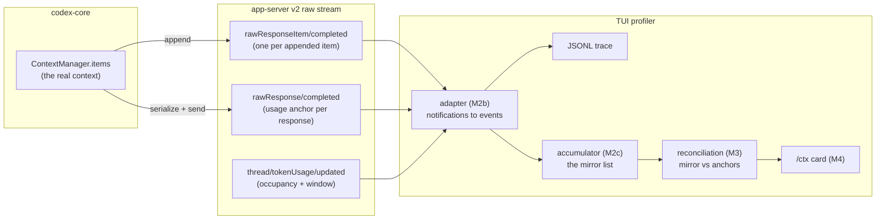
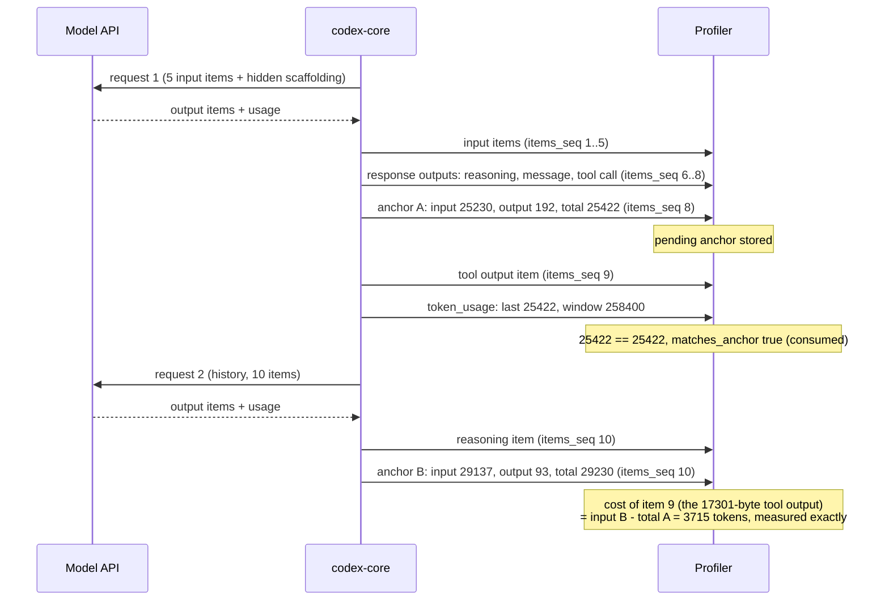
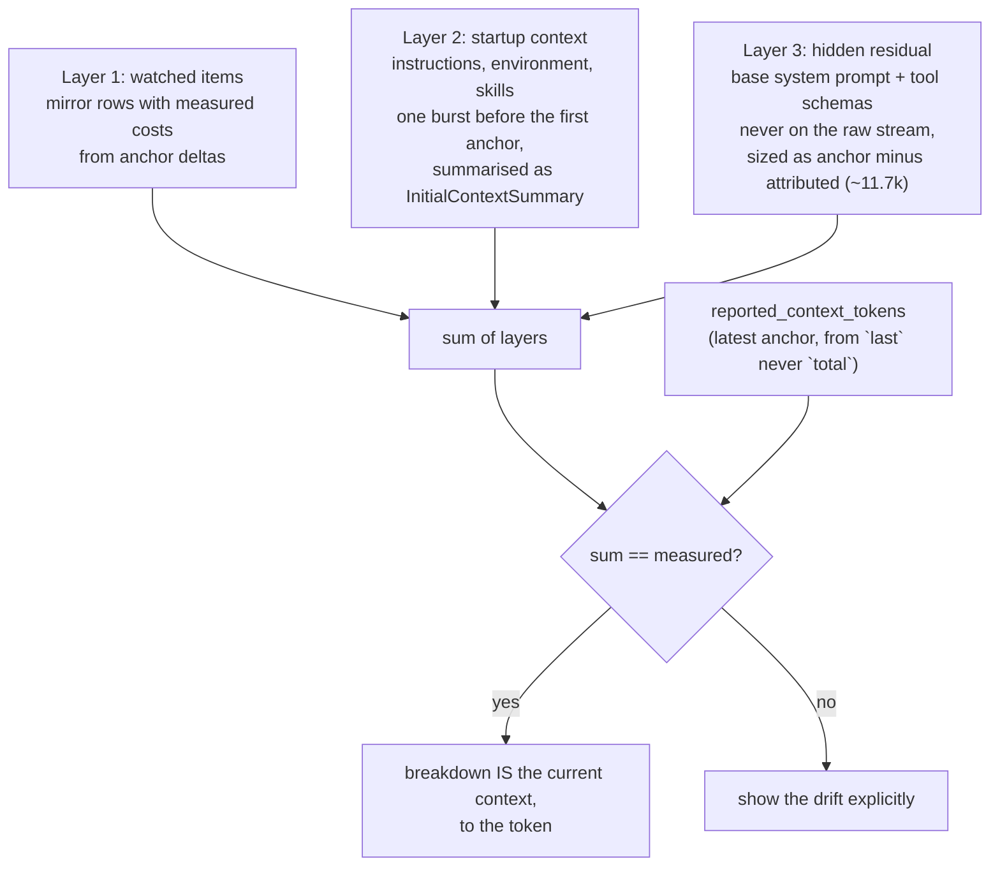
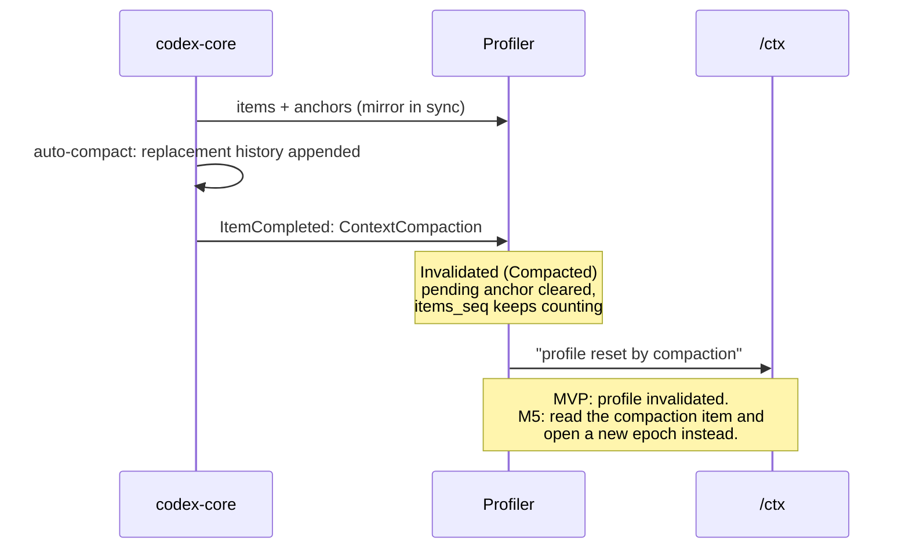
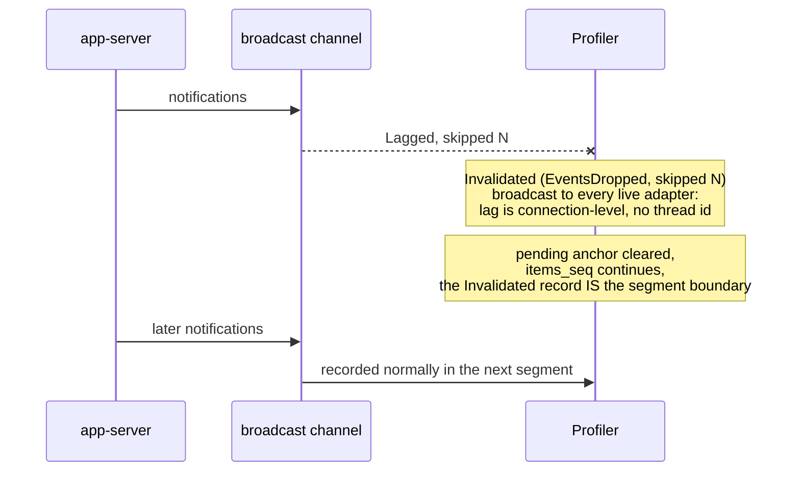
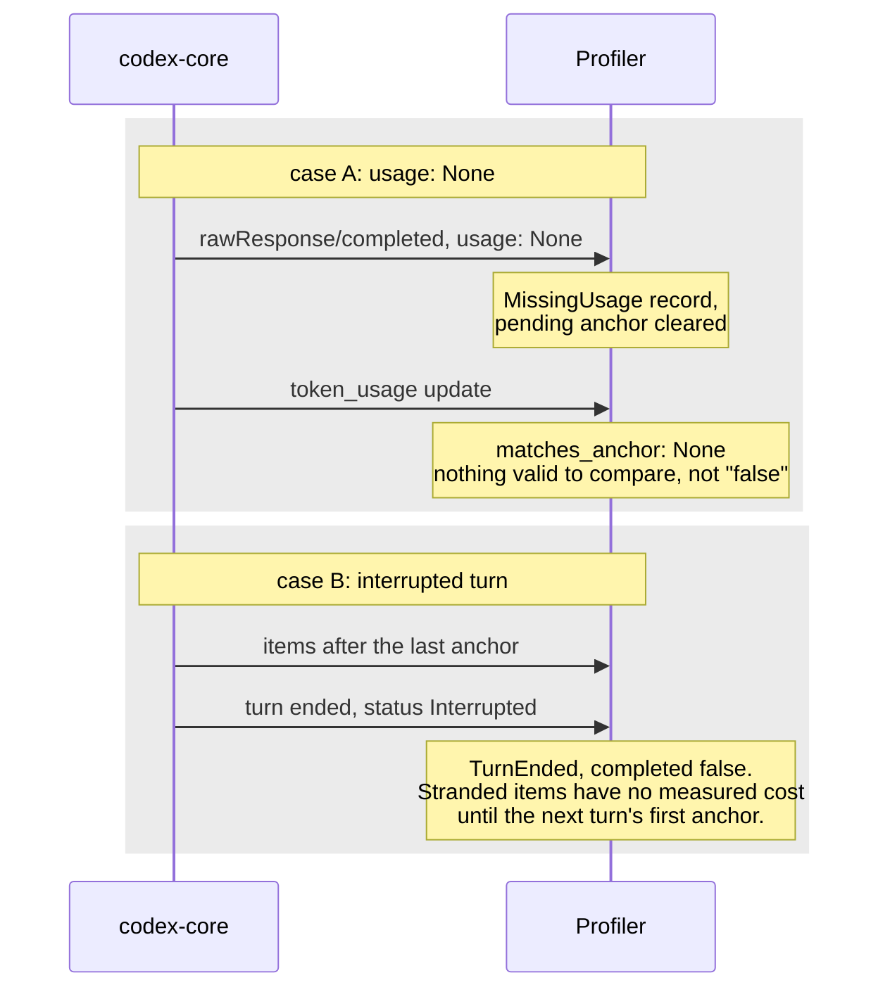
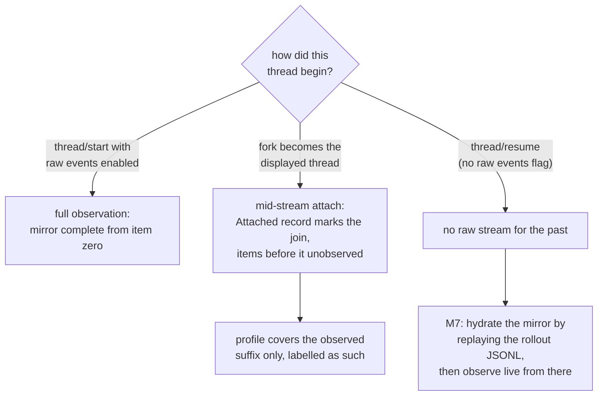

# How the profiler knows the agent's current context

The model is stateless and the server exposes no "give me the current context with sizes" request.
The profiler therefore *reconstructs* the context by watching it being built, then proves the
reconstruction against the provider's own token accounting. This file diagrams that process:
the normal path first, then every case where reconstruction degrades and how each is made
legible rather than silently wrong.

Sources: design spec sections 2-4, findings sections 6 and 10 (measured captures).

## 1. The reconstruction pipeline

The real context lives server-side in `ContextManager.items`. Because history is append-only,
mirroring it from the delta stream is trivially correct: both sides only ever push.

## 2. Normal case: a measured turn

Anchor deltas turn attribution into measurement. Between consecutive anchors,
`input(n+1) - total(n)` is exactly the token cost of the items that arrived in between,
counted by the provider's tokenizer, not estimated by us. `items_seq` stamped on each anchor
is the join key between "which items" and "how many tokens".

## 3. Reconciliation: the three layers of "current context"

What `/ctx` will show is assembled from three sources of decreasing visibility, and the sum
must equal the measured occupancy. Drift is displayed, never hidden.

## 4. Degraded case: compaction (MVP invalidates, M5 segments)

Compaction is a sanctioned history rewrite: the server appends a checkpoint whose
`replacement_history` supersedes the prefix. The mirror is now wrong and cannot be patched
from deltas. On v2 it arrives only as `ItemCompleted` with `ThreadItem::ContextCompaction`
(the deprecated `ContextCompacted` notification is never sent).

## 5. Degraded case: dropped events (channel lag)

The TUI's broadcast channel can lag under load and skip notifications. A gap in the item
stream would silently corrupt every later anchor join, so the profiler marks the segment
boundary instead of guessing.

## 6. Degraded case: missing usage and interrupted turns

Two distinct shapes, both measured in the M1 captures. A response can complete with
`usage: None` (a `MissingUsage` record is written). An interrupted turn ends with no
`rawResponse/completed` at all, so its trailing items are stranded past the last anchor:
no `MissingUsage` is written because no response completed.

## 7. Gap case: attaching late (resume, fork, mid-stream)

Raw events are requested at `thread/start`; resume cannot enable them retroactively, so a
resumed thread's past never reaches the raw stream. The mirror has no history to build from.
The rollout JSONL on disk is the third copy of the memory and the only one that survives a
restart, which is why hydration is a milestone (M7), not a hack.

